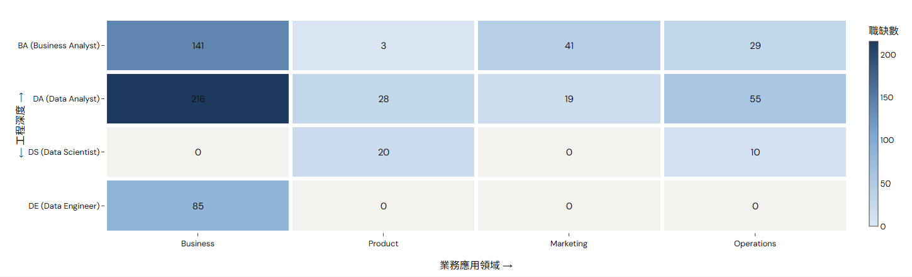
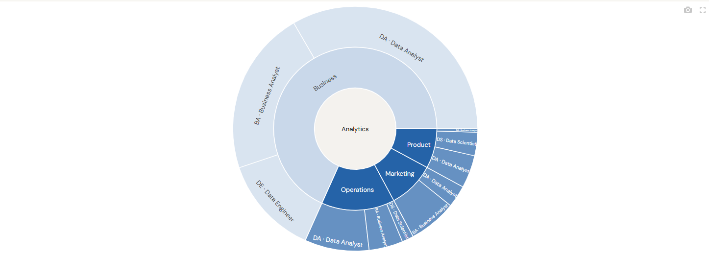
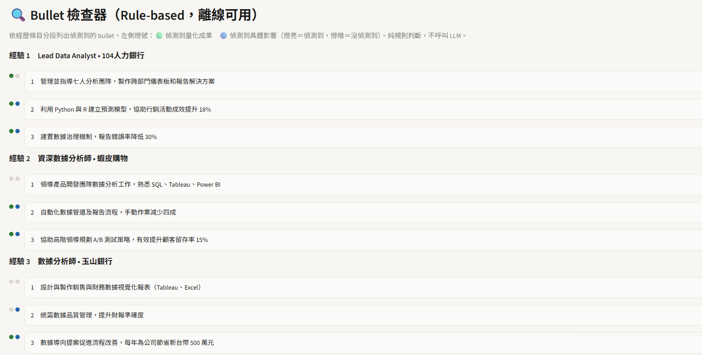

# Career Overfitter

一個幫你在「分析類」職缺的世界裡找方向的工具,資料來自 [104 人力銀行](https://www.104.com.tw/)。

> 這份 README 是寫給**想用這個工具找工作方向的人**看的。如果你是想看技術架構、程式碼設計判斷的人(例如招募官、工程師),請看英文版 [README.md](README.md)。

## 為什麼會有這個工具

如果你正在考慮走「分析」這條路,你可能已經發現一件很煩的事：**同一份工作內容,在不同公司可能叫做 Business Analyst、Product Analyst、Data Analyst、甚至 Data Scientist**。反過來說,職稱相同的兩個工作,實際做的事也可能天差地遠。

用職稱關鍵字去 104 上搜尋,你很難看出：
- 這幾個職稱之間到底差在哪裡?
- 我現在的技能,比較適合往哪個方向走?
- 我缺的技能,是「非會不可」還是「加分項」?
- 這條路市場需求量夠不夠、待遇如何?

**Career Overfitter 想解決的就是這個問題。** 它不是另一個關鍵字搜尋引擎,而是先把整個「分析職缺」的世界畫成一張地圖,讓你先看懂全貌、選一條路,再去看這條路底下實際有哪些職缺——順序反過來,你會看得比較清楚。

## 這個工具能幫你做什麼

### 🗺️ 先看懂整個市場——Explore Careers

打開工具第一眼看到的就是一張熱力圖：橫軸是「你想解決哪一類商業問題」(商業分析／產品分析／行銷分析／營運分析),縱軸是「這個角色離動手做模型/寫程式有多近」(BA → DA → DS → DE,由淺入深)。顏色越深代表這個象限的職缺越多。

點一個格子,可以往下看這個象限底下實際有哪些職稱、目前市場開了多少缺、中位數薪資多少——**在你還沒看到任何一則職缺之前,先知道自己大概落在地圖的哪個位置。**

### 🧭 搞懂一個角色實際在幹嘛——Career Map

從整體地圖點進某一個具體角色(例如「Product Analyst」),會照這個順序告訴你：
1. 這個角色實際上每天在做什麼(用白話講,不是官腔的職缺描述)
2. 常見的相近職稱有哪些(避免你漏看用不同名字包裝的同一種工作)
3. 目前市場需求、中位數薪資、常見的必備技能、常出現這個職缺的公司
4. **如果你已經在 Resume 頁面分析過履歷,這裡會直接顯示你跟這個角色的吻合度**
5. 最後才是真正的職缺列表——刻意放在最後面,因為看懂「這是什麼工作」比看到「有哪些職缺可以投」更重要

### 📄 履歷健檢與職涯建議——Resume

貼上你的履歷內容(或上傳 .txt / .md 檔),這個頁面會做幾件事：

- **抓出履歷裡的技能**,並且算出你跟資料庫裡每個角色的吻合度分數
- **Bullet 檢查器**：把你履歷裡的每一段工作經歷拆開,逐條檢查「有沒有寫具體的量化成果」「有沒有講清楚造成了什麼影響」——不是幫你重寫,而是誠實標出哪幾條 bullet 只是在列工作內容、還沒講到成果,讓你自己決定怎麼補強

- **Career Advisor**：不是那種什麼都能問的萬用聊天機器人,是專門回答「職涯選擇」類問題的——例如「這條路適合我嗎」「我還缺哪些技能」「BI 跟 Product Analytics 差在哪」。回答會盡量參考真實刊登過的職缺內容,不是憑空腦補；就算沒設定 AI 金鑰,也還是能用規則式的統計建議正常運作,不會整個功能開天窗
- **推薦實際職缺**：直接用你的履歷去資料庫裡找出最相似的真實職缺,附連結可以直接點回 104 原始頁面

### 📈 市場趨勢——Market Trends

不是「什麼技能最熱門」這種浮泛排行榜,而是一張「技能 × 領域」的星等對照表,讓你看得出**同一個技能在不同領域裡的重要程度不一樣**——例如 SQL 在哪個領域是基本盤、在哪個領域只是加分。另外也有薪資中位數、產業分布、遠端工作比例可以看。

### 🎯 找職缺——Jobs

跟一般職缺搜尋不一樣的地方是：**先選職涯路徑,再看職缺**,而不是先丟關鍵字。你也可以直接用一句話描述你想做的事(例如「我想做使用者行為分析跟 A/B 測試」),系統會先告訴你這聽起來像哪幾條路徑,再列出底下對應的職缺。

## 怎麼用

1. 先去 **Explore Careers** 看整體市場地圖,對「分析」這個大方向底下有哪些選項有個概念
2. 點進感興趣的象限,到 **Career Map** 看幾個具體角色實際在做什麼
3. 去 **Resume** 頁面貼上你的履歷,看吻合度分數跟 Bullet 檢查器的結果
4. 回到 **Career Map**,這時候每個角色底下都會顯示你的履歷吻合度,幫你比較該往哪個方向準備
5. 最後去 **Jobs** 看實際開出的職缺,或直接用 Resume 頁面的「推薦實際職缺」功能

## 資料從哪裡來、多久更新一次

資料來自 104 人力銀行的公開職缺頁面,涵蓋商業分析、產品分析、行銷分析、營運分析四個領域,固定排程重新爬取與清洗。分類邏輯(哪個職稱歸在哪個角色、哪個領域)是規則式建立的分類表,不是每次都重新用 AI 判斷,確保同一個職稱每次分類結果一致。

## 這個工具不會幫你做的事

- 不會幫你自動大量投遞履歷
- 不會幫你整段生成履歷內容(Bullet 檢查器是刻意設計成「指出問題」而不是「幫你寫」,寫履歷這件事的判斷權還是在你身上)
- 不會生成求職信
- 目前是單次問答,不是可以來回對話、記得上下文的顧問(這件事有列在待做清單裡,但還沒做)

## 技術細節

如果你對這個工具是怎麼做出來的、有哪些工程/資料/AI 上的設計判斷有興趣,完整說明在英文版 [README.md](README.md) 裡,包含資料管線架構、RAG 檢索系統設計、和一段實際除錯案例的完整記錄。
